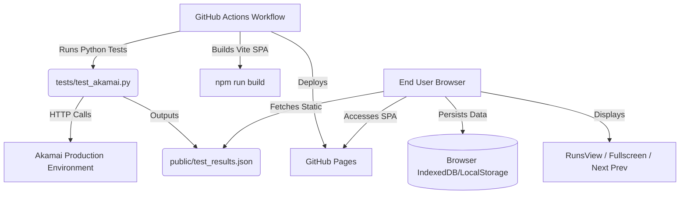

# AWARE Test Telemetry Architecture

## Overview
AWARE is designed for scalable, zero-fabrication telemetry analysis of actual tests running on targeted platforms (such as Akamai).

The architecture relies on a **fully static frontend** deployed to **GitHub Pages**, which consumes a static JSON artifact generated dynamically by **GitHub Actions**.

## Modularity & Configuration
- **Tests**: Located in `/tests/`. Written purely in Python using the standard `unittest` framework and standard library (`urllib`). No external dependencies (`pip`) required! This ensures maximum stability and zero-maintenance overhead.
- **Backend / Deployment**: No custom Node.js server is used. The application is a 100% Client-Side SPA. GitHub Actions handles the compute and test execution on schedule or dispatch, generating a static `test_results.json` artifact that the SPA consumes.
- **Frontend State**: Controlled via `BrowserDb` wrapper for seamless transitions between cached historical data and new test runs pulled statically from the server.

## Adding New Tests
Simply add new methods to `TestAkamai` in `tests/test_akamai.py`. No framework bindings are needed. The custom JSONTestRunner automatically hooks the result into the AWARE pipeline when GitHub Actions triggers the next build.
